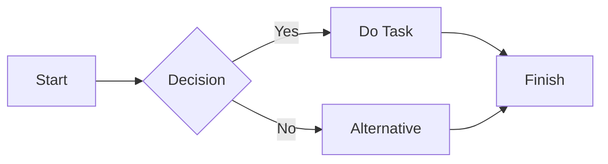

- 👋 Hi, I’m @verrepty1223
- 👀 I’m interested in learning about programming and IT in general
- 🌱 I’m currently learning ❓
- 🧠 I'm know python (basic), csharp, mysql, html, css, asp.net
- 💞️ I’m looking to collaborate on /
- 📫 How to reach me /
- 😄 Pronouns: he/him
- ⚡ Fun fact: / --->

<!---
verrepty1223/verrepty1223 is a ✨ special ✨ repository because its `README.md` (this file) appears on your GitHub profile.
You can click the Preview link to take a look at your changes.
--->

---

---

Press <kbd>Ctrl</kbd> + <kbd>C</kbd> to copy.

